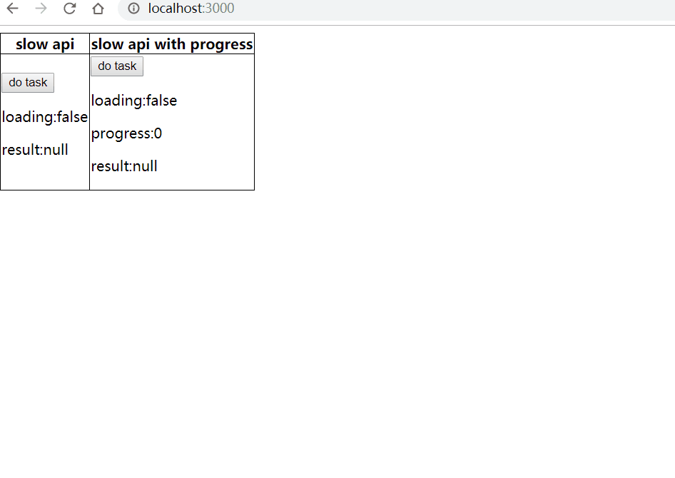

# ue-optimize-slowapi

help people to understand why we need to optimize user experience for slow apis, and how to optimize



## try yourself

```
git clone https://github.com/postor/ue-optimize-slowapi.git
cd ue-optimize-slowapi
npm i
npm run dev
# open http://localhost:3000/
```

## how to optimize

### key codes

- [`comps/NoOptimize.js`](./comps/NoOptimize.js)
- [`comps/Optimized.js`](./comps/Optimized.js)
- [`api/no-optimize.js`](./api/no-optimize.js)
- [`api/optimized.js`](./api/optimized.js)
